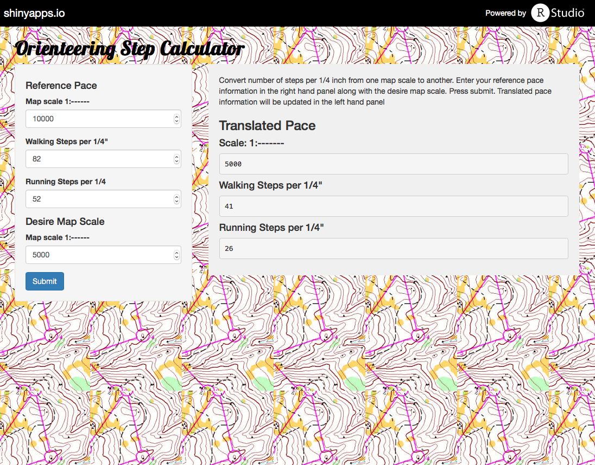

<!-- Limit image width and height -->
<style type='text/css'>
img {
    max-height: 560px;
    max-width: 964px;
}
</style>

<!-- Center image on slide -->
<script src="http://ajax.aspnetcdn.com/ajax/jQuery/jquery-1.7.min.js"></script>
<script type='text/javascript'>
$(function() {
    $("p:has(img)").addClass('centered');
});
</script>

## Overview

The Orienteering Pace Calculator is a simple tool to be used by orienteerers.  

<br>This application converts the number of steps per 1/4 inch from one map scale to another.  
The need for this commonly occurs when going to a variety of orienteering meets as the maps scales 
vary depending on the event.  

<br>Most orienteerers carry a cellphone for route mapping. This application will allow them to use their cell
phone, via a web browser, to easily translate their step counts. 

--- .class #id 

## Application Screenshot



--- .class #id

## Instructions

To use the application:  <br>
1. go to https://raquette.shinyapps.io/Project  
2. Enter your walking and running pace in steps per 1/4" in the left hand panel,  
3. Enter the map scale for the pace above  
4. Enter the map scale at which to calculate the new running and walking paces  
5. Hit the submit button.   
6. The results will appear in the right hand panel.  

--- .class #id

## Calibration

If you don't know your reference pace, here's how to calculate it:  <br>
1. Measure out a fixed distance on the ground in feet.  
2. Walk the distance and count your steps.  
3. Divide the number of steps by the distance in feet and then multiple the total by 208.  
4. This number will be your walking pace for a map at a 1:10000 scale.  
5. Repeat while running to calculate your running pace.  

<br>Example: If you walked 100 feet in 38 steps
```{r}
steps <- 38
distance <- 100
pace <- 208*steps/distance
```
your walking pace would be `r pace` steps per 1/4 @ a map scale of 1:10000.

